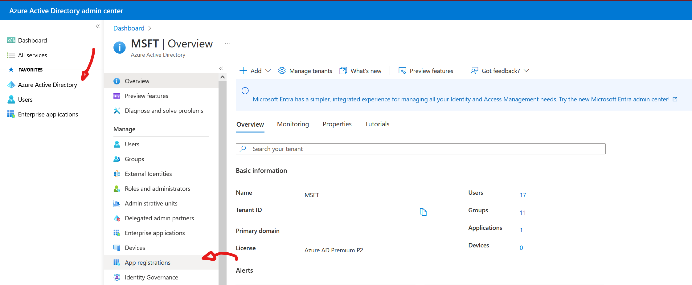
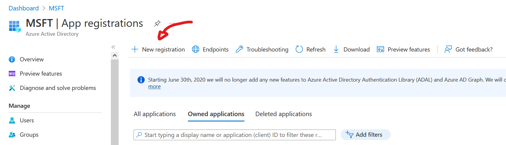
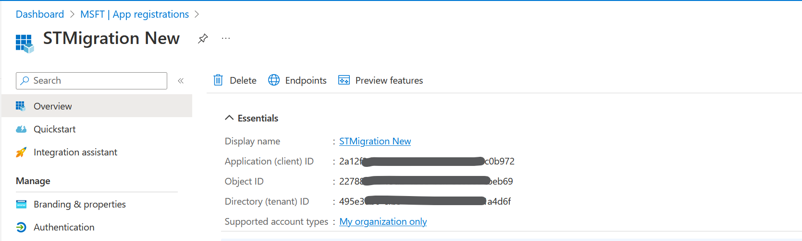
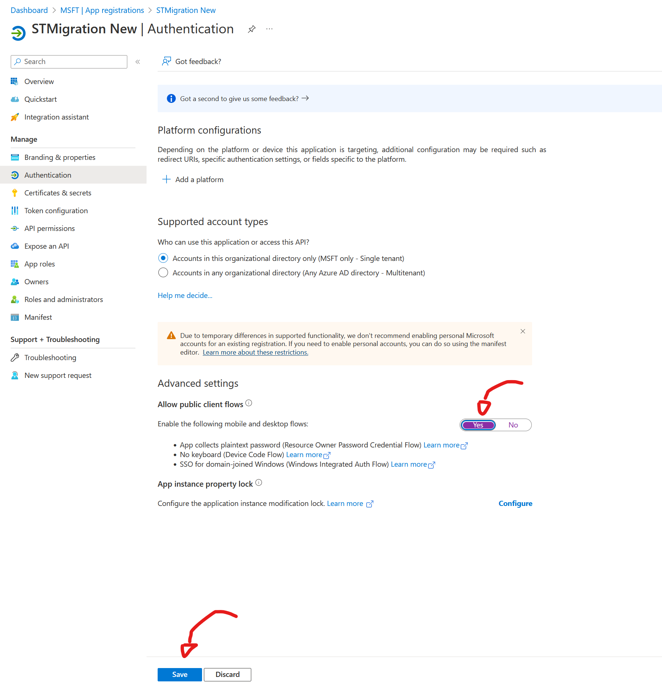
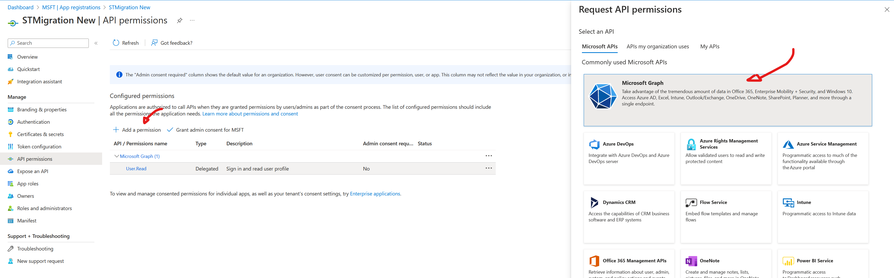
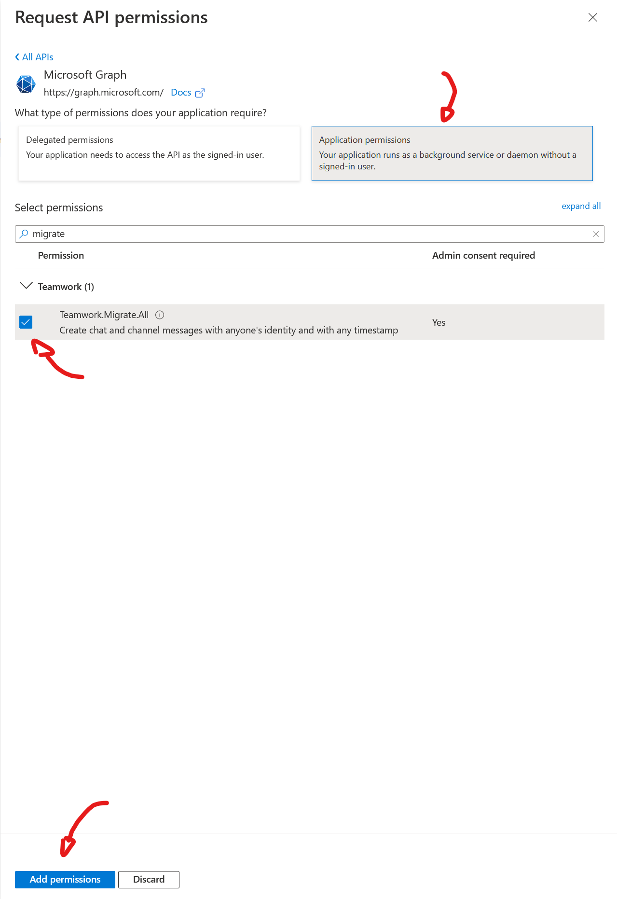
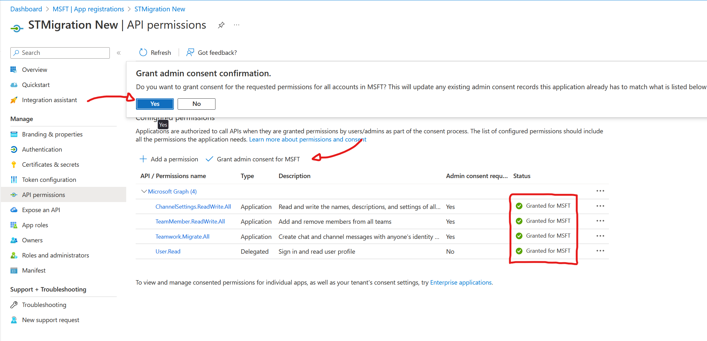
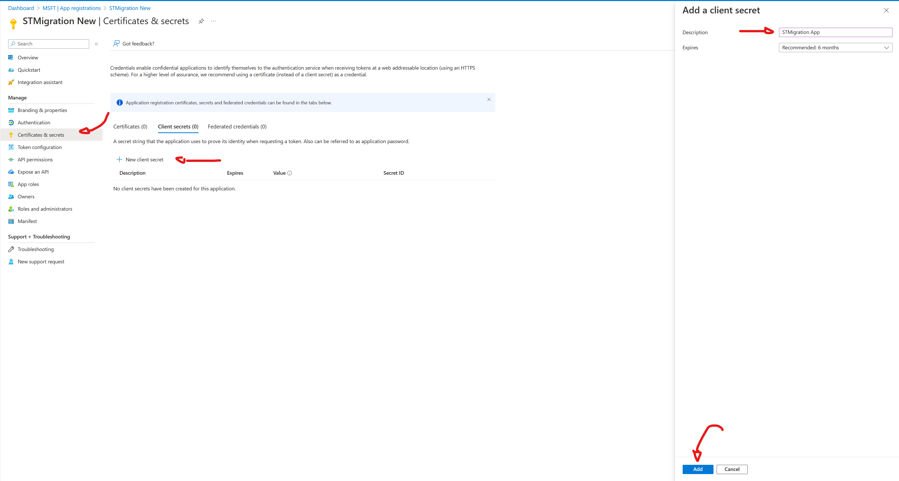
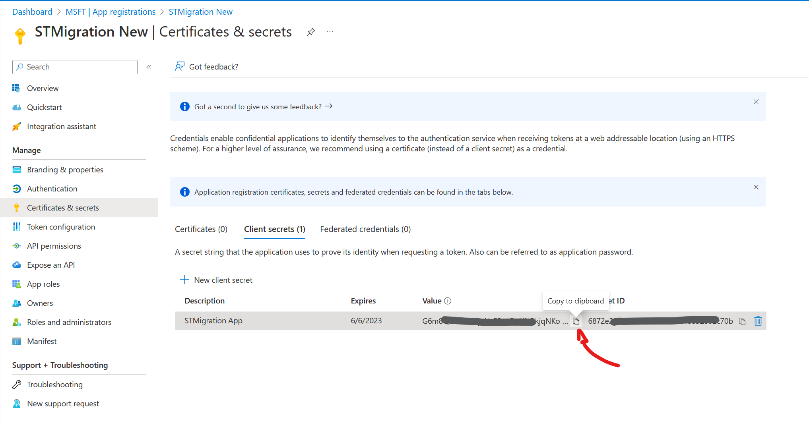
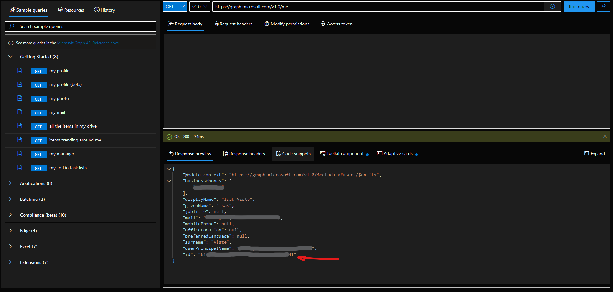

# SlackToTeamsMigration

## Prerequisites

To run the completed project in this folder, you need the following:

- The [.NET SDK](https://dotnet.microsoft.com/download) installed on your development machine. (**Note:** This tutorial was written with .NET SDK version 6.0.102. The steps in this guide may work with other versions, but that has not been tested.)

- A Microsoft work or school account.

If you don't have a Microsoft account, you can [sign up for the Microsoft 365 Developer Program](https://developer.microsoft.com/microsoft-365/dev-program) to get a free Microsoft 365 subscription.

## Register an application

1. Open a browser and navigate to the [Azure Active Directory admin center](https://aad.portal.azure.com) and login using a **personal account** (aka: Microsoft Account) or **Work or School Account**.

1. <details>
        <summary>Select <strong>Azure Active Directory</strong> in the left-hand navigation, then select <strong>App registrations</strong> under <strong>Manage</strong>.</summary>
        
    </details>


1. Register a new application to the **Azure Active Directory**

    1. <details>
        <summary>Select <strong>New registration</strong>.</summary>
        
        </details>
    
    1. Enter a name for your application, for example, `STMigration`.

1. Set **Supported account types** as desired. The options are:

    | Option | Who can sign in? |
    |--------|------------------|
    | **Accounts in this organizational directory only** | Only users in your Microsoft 365 organization |
    | **Accounts in any organizational directory** | Users in any Microsoft 365 organization (work or school accounts) |
    | **Accounts in any organizational directory ... and personal Microsoft accounts** | Users in any Microsoft 365 organization (work or school accounts) and personal Microsoft accounts |

1. Leave **Redirect URI** empty.

1. Select **Register**.

1. <details>
    <summary>Get the <strong>Client</strong> and <strong>Tenant ID</strong> on the application's <strong>Overview</strong> page</summary>
    
    </details>

    1. copy the value of the **Application (client) ID** and save it, you will need it later.
    
    1. Also copy the **Directory (tenant) ID** and save it.

1. <details>
    <summary>Enable <strong>public client flows</strong></summary>
    
    </details>

    1. Select **Authentication** under **Manage**.
    
    1. Locate the **Advanced settings** section and change the **Allow public client flows** toggle to **Yes**, then choose **Save**.

## Configure Application (AAD admin center)

> **Note:** This section requires a work/school account with the Global administrator role.

1. Select **API permissions** under **Manage**.

1. Remove the default **User.Read** permission under **Configured permissions** by selecting the ellipses (**...**) in its row and selecting **Remove permission**.

1. <details>
    <summary>Select <strong>Add a permission</strong>, then <strong>Microsoft Graph</strong></summary>
    
    </details>

    1. Select **Application permissions**.

    1. <details>
        <summary>Select <strong>Teamwork.Migrate.All</strong></summary>
        
        </details><br>

    1. Select **TeamMember.ReadWrite.All**

    1. Select **ChannelSettings.ReadWrite.All**
    
    1. then select **Add permissions**.

    

1. <details>
    <summary>Select <strong>Grant admin consent for...</strong>, then select <strong>Yes</strong> to provide admin consent for the selected permission.</summary>
    
    </details><br>

1. Select **Certificates and secrets** under **Manage**, then select **New client secret**.

    1. <details>
        <summary>Enter a description, choose a duration, and select <strong>Add</strong>.</summary>
        
        </details><br>

    1. <details>
        <summary>Copy the secret from the <strong>Value</strong> column, you will need it soon.</summary>
        
        </details><br>

1. Go to the online [Graph Explorer](https://developer.microsoft.com/en-us/graph/graph-explorer)

    1. Run the default command

    `https://graph.microsoft.com/v1.0/me`

    2. <details>
        <summary>Copy the <strong>team user id</strong> and save it, you will need it in the next step!</summary>
        
        </details><br>
    

## Configure the sample

1. Open [appsettings.json](./STMigration/Data/appsettings.json) and update the values according to the following table.

    | Setting | Value |
    |---------|-------|
    | `ClientId` | The client ID of your app registration |
    | `Tenant` | The tenant ID of your organization |
    | `ClientSecret` | The value of the client secret |
    | `OwnerUserId` | The ID of your team account, will be used to add as owner to newly created team |

## Build and run the sample

In your command-line interface (CLI), navigate to the project directory and run the following commands.

```Shell
dotnet restore
dotnet build
dotnet run
```

